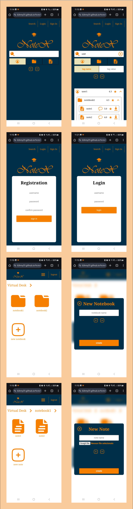
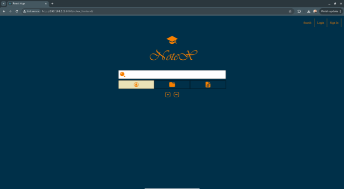

# NoteX


## Introduction

NoteX is a web application designed as part of a Software Engineering course. Its goal is to provide a social platform where students can freely share their notes.<br/>
A working demo of the frontend is online at [https://b3nny01.github.io/NoteX/](https://b3nny01.github.io/NoteX/)

## Development Process

The development of NoteX followed a Rational Unified Process (RUP)-inspired methodology, divided into three key phases:

1. **Requirements Analysis**: Clearly defined the application's requirements to understand its intended functionality.
2. **Problem Analysis**: Identified challenges and proposed technology-independent solutions, focusing on developing the initial application domain model.
3. **Project and Implementation**: Translated the analysis into a concrete project, defining the system architecture and creating a working prototype.

### Use Cases

After the Requirements Analysis, we created the following use case diagram:


The application involves four primary actors:

- **User**: An unauthenticated user who can search and download notes.
- **SignedUser**: A logged-in user who can:
  - Create, delete, and modify notebooks and notes within their virtual desk.
  - Review and report other users' notes.
- **Assistant**: Manages reported users and can shadow ban accounts.
- **Administrator**: Manages Assistant accounts and can restore user accounts.

### Domain Model

During Problem Analysis, we developed the first version of the domain model, starting with actor translation into classes:


A key aspect was the relationship between a SignedUser and their VirtualDesk:


We also modeled the concept of Reports, where users can report others, and Assistants manage these reports:


### Architecture

NoteX follows a three-layer architecture:

1. **Client**: Built with React, the frontend interacts with the server through REST-inspired APIs. We used the create-react-app workflow, with a Node intermediary server between the frontend and the Java backend.
2. **Server**: The backend is powered by Java EE, with APIs organized into groups (e.g., registration, loginAndAuth, user management). Each group is managed by a servlet that delegates business logic to a controller. Controllers retrieve domain classes via Hibernate, execute methods, and persist changes.
3. **Persistence**: Persistence is managed by an RDBMS for domain-related data (e.g., user info, notebook names) and a web server for note files. This hybrid approach was chosen for simplicity and efficiency.

**Development Architecture**:


**Release Architecture**:


## Final Result

Here are the main pages of NoteX:



## Usage

To simplify deployment, NoteX uses Gradle (v8.9, or `gradlew`), npm (v9.2.0), Node.js (v18.19.0), and Docker (v26.1.4).

### Release Architecture

To test the release architecture of the prototype, navigate to the project folder and run:
```bash
./gradlew deploy
```
This task will:

* Remove previous NoteX-related Docker containers.
* Generate the backend notex_backend.war using Gradle in the backend/build/libs folder.
* Build the frontend in the build folder using npm.
* Create and activate new application containers using Docker Compose.

Then, open Chrome and go to `localhost:8080/notex_frontend`, which should display the following screen:



### Development Architecture
To test the development architecture, run:

```bash
./gradlew deployBackend
```

This task will:

* Remove previous NoteX-related Docker containers.
* Generate the backend notex_backend.war using Gradle in the backend/build/libs folder.
* Create and activate new application containers using Docker Compose.

Next, open a terminal in the frontend folder and run:

```bash
npm start
```
This will start a Node server at `localhost:3000/notex_frontend`. Open this link in Chrome to view the NoteX homepage.

### Online Demo
A working demo of the frontend is online at [https://b3nny01.github.io/NoteX/](https://b3nny01.github.io/NoteX/)

[!NOTE]
The online demo only comprehends the frontend, for this reason every backend request (sign in, login, notebook creation, ...) is simulated and produces no real modification

## Credits
The project has been developed by:

* [b3nny01](https://github.com/b3nny01/)
* [aledeni](https://github.com/aledeni)
